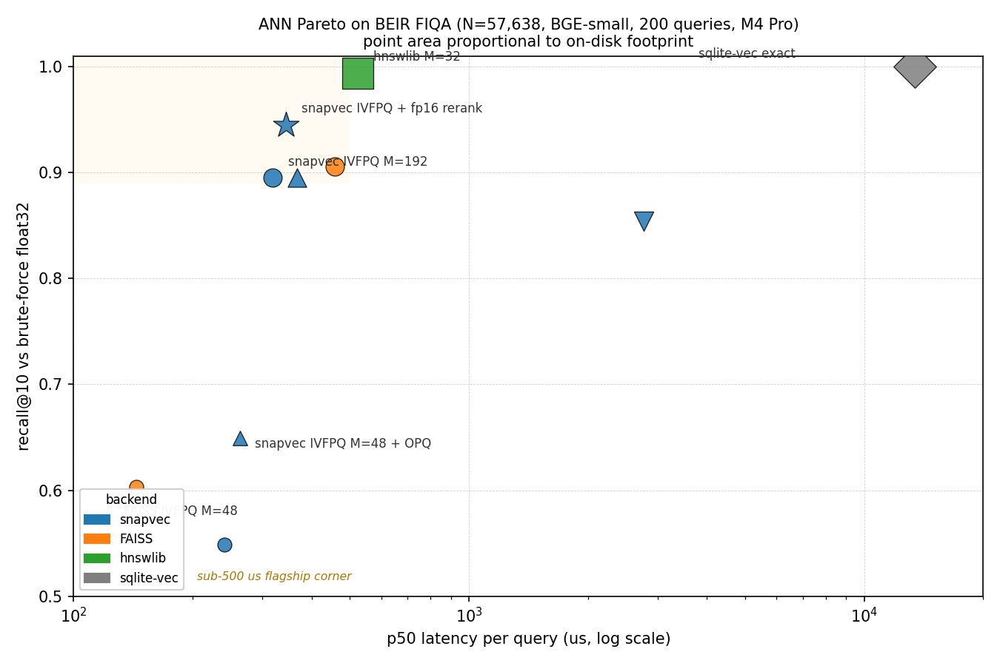

# Benchmarks

All numbers measured on the same hardware with a fixed random seed. Raw
scripts live in [`experiments/`](https://github.com/stffns/snapvec/tree/main/experiments);
a reproducible CI-runnable suite is planned.

## Headline: IVFPQSnapIndex on FIQA

BEIR FIQA, N = 57,638, dim = 384 (BGE-small), nlist = 512, M = 192, K = 256.
`keep_full_precision=True`, `rerank_candidates=100`.

| `nprobe` | Configuration | recall@10 | Latency (us/query) |
|---------|---------------|-----------|--------------------|
| 8 | PQ only | 0.85 | 180 |
| 32 | PQ only | 0.92 | 340 |
| 64 | PQ + fp16 rerank | **0.977** | **441** |
| 256 | PQ + fp16 rerank | **0.998** | **1021** |

5.8x speedup vs v0.6 at identical recall, past the PQ-only 0.929 ceiling.

## Head-to-head: snapvec vs FAISS vs hnswlib vs sqlite-vec

Single unified table across every backend tested, at their standard
operating points **and** at matched-budget points where we have a
comparable PQ config.  Goal is to let the reader see the full Pareto
shape rather than cherry-picked wins.



Point area is proportional to the on-disk footprint of the index
file (the third axis of the tradeoff).  Rows sitting up-and-left
are the frontier; anything further down-and-right is dominated.

!!! info "Scope and methodology"
    **Dataset.** BEIR FIQA, one of the BEIR retrieval benchmarks.
    Embeddings are BGE-small (dim = 384), corpus N = 57,638,
    unit-normalised.  200 queries sampled from the 648 test
    queries.  Ground truth is float32 brute-force top-10 dot
    product on the same unit-normalised corpus (recall@10 is
    against exact NN).

    **Hardware.** Apple M4 Pro, 12 cores, 24 GB RAM, macOS 14.
    Every backend pinned to a single thread
    (`faiss.omp_set_num_threads(1)` at module level, and
    `idx.set_num_threads(1)` on the hnswlib instance; snapvec default
    is already serial) for apples-to-apples per-query latency.
    GC disabled inside the timing loop.  p50 and p99 reported
    across the query set (median, not mean, to shrug off outliers).

    **Versions.** snapvec 0.11.0, faiss-cpu 1.13.2, hnswlib 0.8.0,
    sqlite-vec 0.1.7, NumPy 2.4.3, Python 3.12.

    **What this table isn't.** Evidence that snapvec beats FAISS on
    *your* dataset.  Modern embeddings vary in coordinate-variance
    shape, and OPQ gains in particular are distribution-dependent.
    Run `python experiments/bench_competitive.py` on your own
    corpus before citing these numbers in a design review.

Every row below is approximate (recall < 1.0) **except sqlite-vec**,
which is an exact brute-force scan.  snapvec has no exact mode --
every `SnapIndex` / `PQSnapIndex` / `IVFPQSnapIndex` variant quantizes
the vectors on ingest, so the lowest-tier `SnapIndex 4-bit` row is
"full-scan + scalar quantization", **not** flat-exact in the FAISS
`IndexFlat` sense.  For flat-exact behaviour with snapvec's storage
story, use sqlite-vec or FAISS `IndexFlatIP`.

| Backend | recall@10 | p50 us | p99 us | disk MB | build s |
|---------|----------:|-------:|-------:|--------:|--------:|
| sqlite-vec (brute-force cosine, exact) | **1.000** | 13401 | 40936 | 91.1 | 0.6 |
| hnswlib (M=32, ef_search=128) | 0.994 | 524 | 824 | 104.5 | 44 |
| **snapvec IVFPQ + fp16 rerank (M=192)** | **0.945** | **345** | 510 | 56.9 | 111 |
| FAISS IVFPQ (M=192) [matched-budget] | 0.906 | 457 | 550 | 12.7 | 17 |
| **snapvec IVFPQ no rerank (M=192)** | 0.895 | **319** | 502 | 12.6 | 110 |
| snapvec IVFPQ no rerank (M=192) + OPQ | 0.895 | 368 | 557 | 13.2 | 112 |
| snapvec SnapIndex 4-bit scalar (full-scan) | 0.854 | 2764 | 3099 | 15.4 | 1.1 |
| snapvec SnapIndex 3-bit scalar (full-scan) | 0.736 | 2742 | 3815 | 11.7 | 0.8 |
| **snapvec IVFPQ no rerank (M=48) + OPQ** | **0.649** | 263 | 331 | 4.9 | 33 |
| snapvec SnapIndex 2-bit scalar (full-scan) | 0.618 | 2740 | 5594 | 8.0 | 0.7 |
| FAISS IVFPQ (M=48) | 0.603 | 144 | 217 | 4.4 | 10 |
| snapvec IVFPQ no rerank (M=48) [matched-budget] | 0.549 | 241 | 319 | 4.3 | 34 |

Rows ordered by recall@10 descending.

**Methodology.** All numbers come from a single end-to-end invocation
of `experiments/bench_competitive.py`.  The orchestrator spawns one
subprocess per backend (each backend bundles its own libomp; loading
two into the same Python process crashes on macOS arm64) but all four
subprocesses run back-to-back in one session so OS page-cache state
does not drift between earlier and later rows.  An earlier
multi-session measurement showed a ~56% p50 delta on SnapIndex between
cold and warm runs; the single-invocation convention above eliminates
that.

Thread pinning: `faiss.omp_set_num_threads(1)` + `idx.set_num_threads(1)`
on the hnswlib instance (set before `add_items`) for apples-to-apples
build and search timings.  snapvec's `fit` still uses whatever NumPy
BLAS is configured to; for this machine `np.show_config()` reports
Accelerate with its default thread count.  Expected run-to-run noise
on this hardware is <=5% p50 for every row except hnswlib, which
hits ~10-15% routinely.

### Reading the table

The Pareto frontier (no backend strictly dominated) is:

1. **Aggressive-compression corner (~4.5 MB) is a recall-vs-latency
   trade**: FAISS IVFPQ M=48 takes the fastest-at-this-disk point
   (0.603 recall at 144 us), snapvec IVFPQ M=48 + OPQ takes the
   highest-recall point (0.649 recall at 263 us).  Baseline snapvec
   at M=48 without OPQ is dominated (lower recall than FAISS at
   higher latency) -- reach for `use_opq=True` at this budget.
2. **snapvec IVFPQ M=192** matches FAISS M=192 on disk (12.6 vs
   12.7 MB) and on recall (0.895 vs 0.906) while being **1.4x faster**
   at p50 (319 vs 457 us).  This is the matched-budget headline.
   OPQ at M=192 is **not worth it** (same recall, +16% latency,
   +576 KB disk): the 2-dim subspaces have no room for the rotation.
3. **snapvec IVFPQ + fp16 rerank** is the Pareto-dominant high-recall
   point under 500 us: 0.945 recall at 345 us -- faster than FAISS
   M=192 AND higher recall, at the cost of a 4.5x larger index file
   (holds a float16 copy for the rerank pass).
4. **hnswlib** reaches the highest non-exact recall (0.994) but pays
   with disk (104 MB) and p99 latency (824 us).
5. **sqlite-vec** is exact (recall 1.000) but its brute-force
   cosine scan is 13.4 ms -- ~40x slower than any of the ANN backends
   on this N.  It's the 'zero ANN tuning, accept the latency' baseline.

### Positioning in plain language

- If you need **one dependency, no training, acceptable latency on
  small N**: `SnapIndex` at 4-bit scalar or sqlite-vec.  snapvec is
  ~5x faster (2.7 ms vs 13.9 ms) but gives up exactness (0.85 vs
  1.00 recall) because it quantizes the vectors.  `SnapIndex` p50
  latency is essentially constant across bit depths (the fp16
  centroid-expansion matmul dominates); the recall/disk tradeoff is
  the only knob you turn.
- If you have **space for PQ training and want aggressive disk
  compression (~4-5 MB)**: two viable picks.  FAISS IVFPQ M=48 is
  the fastest (144 us p50, 0.603 recall).  snapvec IVFPQ M=48 +
  `use_opq=True` is the highest recall (0.649) at 1.8x the latency
  (263 us).  Both at ~identical disk.
- If you want **matched disk and the fastest ANN latency for
  recall ~0.9**: snapvec IVFPQ M=192.
- If you want **recall approaching 0.95 in sub-millisecond latency**:
  snapvec IVFPQ + fp16 rerank (4.5x disk for ~5 pp recall lift).
- If you want **the highest recall regardless of disk / tail
  latency**: hnswlib.

### Caveats

- FAISS `fit` is ~6.5x faster than snapvec's `fit` at the same config
  (17 s vs 110 s at M=192).  Build time is a real competitive gap.
- At M=48 without OPQ, FAISS's PQ training beats snapvec's.
  Turning on `use_opq=True` flips that: snapvec + OPQ hits 0.649
  recall at M=48 versus FAISS's 0.603, at comparable disk (4.9 vs
  4.4 MB).  Baseline (non-OPQ) snapvec is dominated on this corner
  so reach for `use_opq=True` at aggressive compression.
- These are serial per-query numbers.  hnswlib in particular gets a
  large speedup from its default thread pool; the [threading curve]
  section covers how snapvec scales batched search.

Reproduce with `python experiments/bench_competitive.py` after
caching both `experiments/.cache_fiqa_bge_small.npy` and
`experiments/.cache_fiqa_queries_bge_small.npy`.

## OPQ rotation: recall vs M (single dataset)

**Scope.** These numbers come from **one dataset, BEIR FIQA with
BGE-small**.  OPQ gains depend on the source distribution; on
datasets with near-isotropic coordinate variance the rotation has
nothing to redistribute.  Treat this as "OPQ's behaviour on modern
sentence embeddings" rather than a universal claim.

Setup identical to the competitive table: N = 57,638, dim = 384,
nlist = 512, normalized=True, rerank disabled.  300 queries sampled
from FIQA's test set.

| `M` | `d_sub` | recall@10 (baseline) | recall@10 (OPQ) | delta | disk MB |
|----:|--------:|---------------------:|----------------:|------:|--------:|
|  48 |    8    |               0.553  |       **0.656** | +10.3 pp |   4.3  |
|  96 |    4    |               0.767  |       **0.812** |  +4.6 pp |   6.5  |
| 192 |    2    |               0.932  |             0.931 |   0.0 pp  |  12.6  |

OPQ helps when subspaces have room to redistribute variance
(`d_sub >= 4`).  At `d_sub = 2` the rotation has almost no freedom --
it can only pair up two dimensions at a time -- so the recall
delta collapses.  Latency is identical in all three rows (the
extra matmul at preprocess is ~10 us and hides in the noise floor).

The M=48 row is the interesting one.  Baseline snapvec at that
budget is the matched-budget underdog in the head-to-head against
FAISS IVFPQ (0.553 vs FAISS's 0.603 at M=48, see competitive
table above).  With OPQ the same snapvec config hits 0.656 on the
same corpus -- pulling the snapvec curve above FAISS at the
aggressive-compression corner, on this dataset.  How much of that
carries to other BEIR tasks or to non-BGE embeddings is not measured
in this repo; run the bench with your own corpus to check before
shipping it as a claim.

### Training cost

OPQ adds one eigendecomposition of the `(dim, dim)` covariance to
`fit()`.  Measured on the FIQA training sample:

| N (training rows) | dim | `fit_opq_rotation` time | peak memory |
|-------------------|-----|-------------------------|-------------|
| 10,000            | 384 | 21 ms                    | 52 MB       |
| 57,638            | 384 | 56 ms                    | 271 MB      |

The memory peak comes from the intermediate `float64` cast used
during covariance accumulation (needed for numerical stability at
large N).  At N = 1M this scales to about 3 GB transiently; split
the training set or upstream a `float64` cast of a sample if that
is a concern.  The stored rotation matrix itself is
`dim * dim * 4` bytes (576 KB at dim=384).

Runtime cost is negligible: the query rotation is a
`(1, dim) @ (dim, dim)` matmul at ~1.6 us, and a batched
`(200, dim) @ (dim, dim)` is ~42 us -- both hidden by the rest of
the search pipeline.

Reproduce with `python experiments/bench_ivfpq_opq.py` after
caching the FIQA corpus.

## Historical: snapvec vs sqlite-vec across N

The earlier (pre-competitive-table) snapvec-vs-sqlite-vec scale
measurement, kept for the absolute scaling story snapvec unlocks.
`snapvec` at `nprobe=64` + rerank.

| N | sqlite-vec | snapvec | Speedup | Recall tradeoff |
|---|------------|---------|---------|-----------------|
| 10k | 2.3 ms | 0.44 ms | 5x | 0.997 |
| 57k | 15.1 ms | 0.44 ms | 34x | 0.977 |
| 100k | 23.8 ms | 1.04 ms | 23x | 0.994 |
| 500k | ~110 ms | 0.9 ms | 125x | ~0.97 |
| 1M | brute-force infeasible | 1.1 ms | -- | -- |

## Batched search threading curve

`IVFPQSnapIndex.search_batch` fans out per-query scoring across worker
threads.  Threading is a throughput knob, not a per-call latency knob:
the single `search()` API is serial on purpose (it competes with
NumPy's internal BLAS pool; see the docstring).

Same FIQA corpus as above (N = 57,638, dim = 384), batch_size = 128,
measured on an Apple M4 Pro (12 cores), NumPy 2.4.3, Python 3.12.

| `nprobe` | t=1 ms/q | t=2 ms/q | t=4 ms/q | t=8 ms/q | best speedup |
|---------:|---------:|---------:|---------:|---------:|:------------:|
| 4   | 0.09 | 0.06 | **0.05** | 0.06 | 1.69x |
| 8   | 0.15 | 0.09 | **0.07** | 0.09 | 2.31x |
| 16  | 0.29 | 0.16 | **0.10** | 0.13 | 2.92x |
| 32  | 0.50 | 0.28 | **0.16** | 0.20 | 3.06x |
| 64  | 0.95 | 0.51 | **0.29** | 0.33 | 3.31x |
| 128 | 1.84 | 0.98 | **0.54** | 0.57 | 3.43x |
| 256 | 3.70 | 1.91 | **1.01** | 1.09 | 3.67x |

Observations:

- **`num_threads=4` is the sweet spot** on this machine across every
  nprobe.  At `num_threads=8` the curve regresses; the executor
  over-subscribes the efficiency cores and starts fighting BLAS.
- **Scaling improves with `nprobe`** because per-query work grows:
  at `nprobe=4`, threading overhead caps speedup at 1.7x; at
  `nprobe=256` it reaches 3.7x.
- **Sub-millisecond at 4 threads** for `nprobe <= 64`, which spans
  the 0.85 to 0.977 recall range from the headline table above.
  That is 3,400 - 20,000 queries per second per process.

Reproduce with `python experiments/bench_ivf_pq_threading.py` after
caching both the FIQA corpus (`experiments/.cache_fiqa_bge_small.npy`)
and the FIQA queries (`experiments/.cache_fiqa_queries_bge_small.npy`).

## Compression ratios

For BGE-small (dim=384, float32 baseline = 1536 B/vec):

| Index | Config | B/vec | Compression |
|-------|--------|-------|-------------|
| `SnapIndex` | bits=2 | 132 | 11.6x |
| `SnapIndex` | bits=3 | 196 | 7.8x |
| `SnapIndex` | bits=4 | 260 | 5.9x |
| `PQSnapIndex` | M=16 | 16 | 96x |
| `PQSnapIndex` | M=32 | 32 | 48x |
| `IVFPQSnapIndex` | M=192 + fp16 rerank | ~960 | 1.6x (rerank cache dominates) |
| `IVFPQSnapIndex` | M=192, no rerank | ~192 | 8x |

## Reproduction

```bash
pip install -e ".[dev]"
python experiments/bench_v090_fiqa.py               # FIQA recall / latency
python experiments/bench_ivf_pq_threading.py        # search_batch threading curve
python experiments/bench_sqlite_vec_baseline.py     # sqlite-vec comparison
```

The `experiments/` folder is WIP; expect rough edges. A first-class
`bench/` suite that runs in CI and emits machine-readable results is
tracked on the roadmap.
